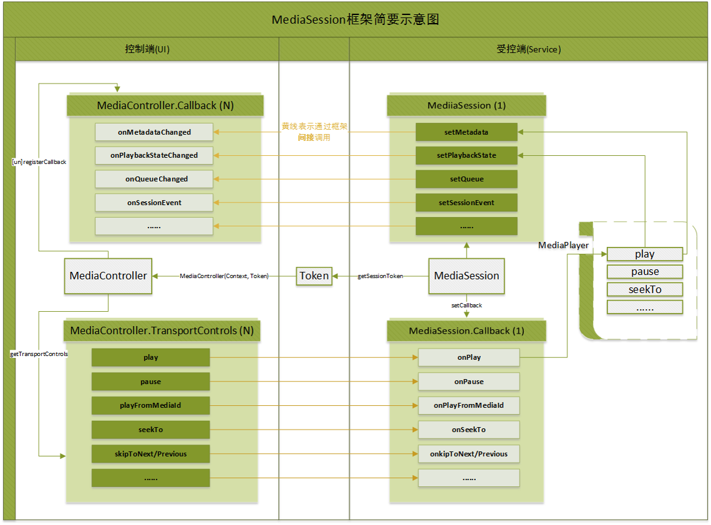
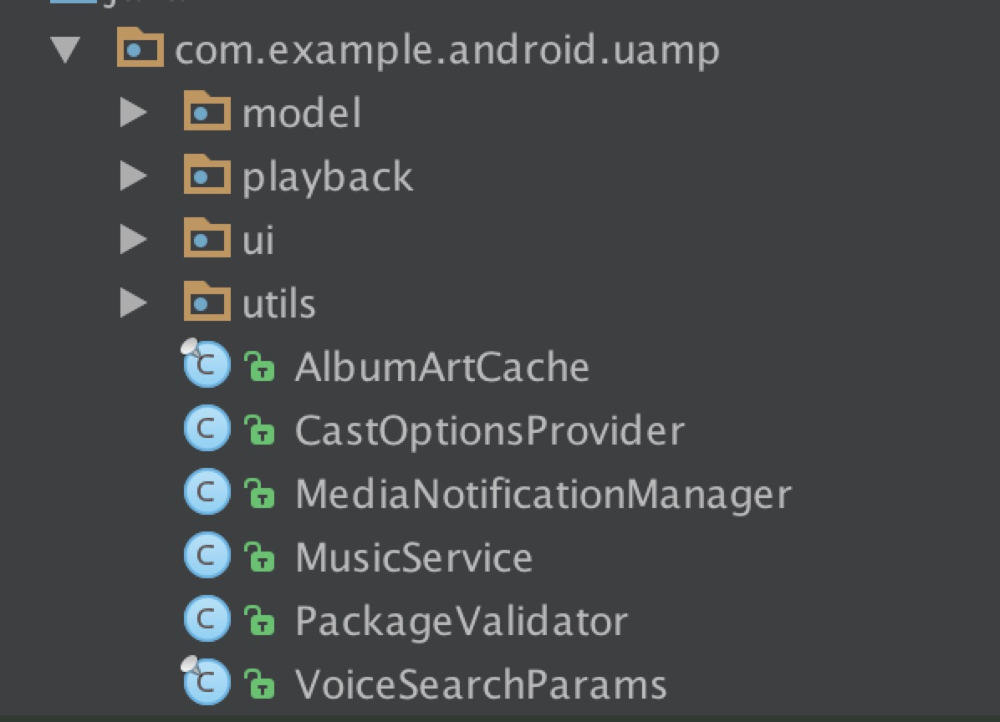
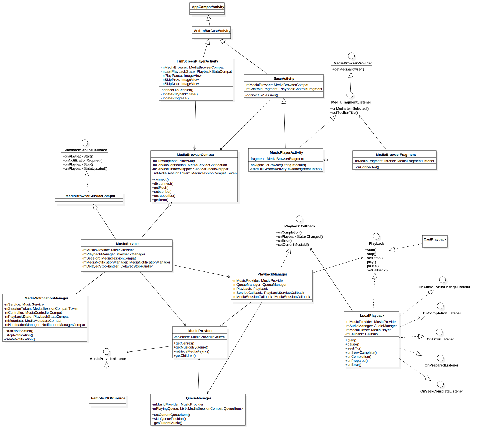

android-UniversalMusicPlayer 源码解析
====================================
> 本文为 [android-UniversalMusicPlayer源码解析](https://github.com/googlesamples/android-UniversalMusicPlayer) 分析的版本：[39fa286](https://github.com/googlesamples/android-UniversalMusicPlayer/commit/39fa286313639b5ce069e755c18762aaa1f59ea9)，Demo 地址：[android-UniversalMusicPlayer](https://github.com/googlesamples/android-UniversalMusicPlayer)    
 分析者：[kevinshine](https://github.com/kevinshine)

### 1. 功能介绍  
#### 1.1 android-UniversalMusicPlayer
该项目为googlesamples中提供的一个完整音频播放APP示例。其中不但介绍了标准的播放器前后台实现，还包括了如何横跨Android Auto, Android Wear, Android TV等平台的提供一致性用户体验。以下简称uamp。
#### 1.2 MediaSession架构
Android5.0 提出了全新的MediaSession概念用于播放器与控制器之间进行交互，它的出现为多控制端单服务端的结构提供了有力的支持（一套方案支持Auto，Wear）。uamp底层播放架构都是基于
v4包中的MediaSessionCompat，所以uamp同时也是非常好的MediaSession框架demo。
参考网上的一张结构图可以更好的理解：
  

### 2. 详细设计
#### 2.1 软件架构介绍
uamp的代码按照标准的MVC模式划分目录，model，ui，playback分别代表了各个层。

#### 2.2 类关系图
 

### 3. 流程图
简单的播放流程如下：

   


### 4. 总体设计
参考uamp的分层罗辑，从MVC各个层的主要类开始分析
#### 4.1 View层
##### 4.1.1 MusicPlayerActivity
整个应用的入口，在其onCreate中处理Intent并根据需要展示目录或进入播放界面。
其父类BaseActivity的onCreate中，初始化了MediaBrowser
```
public void onCreate(Bundle savedInstanceState) {
        ........
        // Connect a media browser just to get the media session token. There are other ways
        // this can be done, for example by sharing the session token directly.
        mMediaBrowser = new MediaBrowserCompat(this,
            new ComponentName(this, MusicService.class), mConnectionCallback, null);
    }
```
并在onStart和onStop中维护生命周期
```
    protected void onStart() {
        .......
        mMediaBrowser.connect();
    }

    protected void onStop() {
        ......
    
        mMediaBrowser.disconnect();
    }
```
MediaBrowser用来访问指定的MediaBrowserService中的内容，即mMediaBrowser用来访问MusicService。
在MediaBrowser的connect方法中会bind到MusicService并将Binder进行包装，封装交互参数。
当建立连接成功后会回调到mConnectionCallback的onConnected()方法，通过connectToSession将获取到的MediaBrowser中的token作为参数创建MediaControllerCompat，再通过setSupportMediaController(mediaController)方法赋值到MusicPlayerActivity，则MusicPlayerActivity与MusicService建立起了连接。

#### 4.1.2 FullScreenPlayerActivity
顾名思义这个界面是个全屏的播放详情及控制界面，里面包含了全部的播放控制按钮（play，pause，seekbar等），以及专辑、曲目信息显示。与BaseActivity相同，通过MediaBrowser的建立与MusicService的联系。在播放控制View的OnClickListener实现中，获取当前MediaController的TransportControls，并发送对应指令。

```
                MediaControllerCompat.TransportControls controls =
                            getSupportMediaController().getTransportControls();
                    switch (state.getState()) {
                        case PlaybackStateCompat.STATE_PLAYING: // fall through
                        case PlaybackStateCompat.STATE_BUFFERING:
                            controls.pause();
                            stopSeekbarUpdate();
                            break;
                        case PlaybackStateCompat.STATE_PAUSED:
                        case PlaybackStateCompat.STATE_STOPPED:
                            controls.play();
                            scheduleSeekbarUpdate();
                            break;
                        default:
                            LogHelper.d(TAG, "onClick with state ", state.getState());
                    }
```

Seekbar的更新使用了ScheduledExecutorService
```
    private final ScheduledExecutorService mExecutorService =
        Executors.newSingleThreadScheduledExecutor();
    
    
    private void scheduleSeekbarUpdate() {
        .....
            mScheduleFuture = mExecutorService.scheduleAtFixedRate(
                    new Runnable() {
                        @Override
                        public void run() {
                            mHandler.post(mUpdateProgressTask);
                        }
                    }, PROGRESS_UPDATE_INITIAL_INTERVAL,
                    PROGRESS_UPDATE_INTERNAL, TimeUnit.MILLISECONDS);
        ....
    }
    
    //更新seekbar
    private void updateProgress() {
        ........
        long currentPosition = mLastPlaybackState.getPosition();
        if (mLastPlaybackState.getState() != PlaybackStateCompat.STATE_PAUSED) {
            long timeDelta = SystemClock.elapsedRealtime() -
                    mLastPlaybackState.getLastPositionUpdateTime();
            currentPosition += (int) timeDelta * mLastPlaybackState.getPlaybackSpeed();
        }
        mSeekbar.setProgress((int) currentPosition);
    }
```

##### 4.1.3 MusicService
MusicService的继承自MediaBrowserServiceCompat，所以首先它是一个标准的Service。作为后台播放的核心类，其中包含对于MediaNotificationManager、PlaybackManager，MusicProvider等主要功能模块的使用。

在MusicService的onCreate中，对各个类进行初始化。从命名上也可大致了解各个类的作用。
* MediaNotificationManager：封装了对于NotificationManagerCompat的操作，包括点击事件的响应，显示状态同步，Service前后台状态切换
* PlaybackManager：播放状态控制
* QueueManager：管理播放队列，对其操作都定义在PlaybackManager中
* MusicProvider：音乐资源的Provider，定义了所有的资源操作接口

初始化
```
public void onCreate() {
        ......
        
        //初始化MusicProvider，并调用retrieveMedia()异步加载数据
        mMusicProvider = new MusicProvider();
        mMusicProvider.retrieveMediaAsync(null /* Callback */);
        ......
        //初始化QueueManager，后续当调用QueueManager中的方法如setCurrentQueue()时，
        //会回调MetadataUpdateListener中的方法向外通知
        QueueManager queueManager = new QueueManager(mMusicProvider, getResources(),
                new QueueManager.MetadataUpdateListener() {
                    @Override
                    public void onMetadataChanged(MediaMetadataCompat metadata) {
                        mSession.setMetadata(metadata);
                    }

                    @Override
                    public void onMetadataRetrieveError() {
                        mPlaybackManager.updatePlaybackState(
                                getString(R.string.error_no_metadata));
                    }

                    @Override
                    public void onCurrentQueueIndexUpdated(int queueIndex) {
                        mPlaybackManager.handlePlayRequest();
                    }

                    @Override
                    public void onQueueUpdated(String title,
                                               List<MediaSessionCompat.QueueItem> newQueue) {
                        mSession.setQueue(newQueue);
                        mSession.setQueueTitle(title);
                    }
                });
                
        //初始化PlaybackManager
        LocalPlayback playback = new LocalPlayback(this, mMusicProvider);
        mPlaybackManager = new PlaybackManager(this, getResources(), mMusicProvider, queueManager,
                playback);

        //最核心的对象，定义了该服务的Session，并通过setSessionToken赋值，client端通过此Token与Service关联
        mSession = new MediaSessionCompat(this, "MusicService");
        setSessionToken(mSession.getSessionToken());
        mSession.setCallback(mPlaybackManager.getMediaSessionCallback());
        mSession.setFlags(MediaSessionCompat.FLAG_HANDLES_MEDIA_BUTTONS |
                MediaSessionCompat.FLAG_HANDLES_TRANSPORT_CONTROLS);

        Context context = getApplicationContext();
        Intent intent = new Intent(context, NowPlayingActivity.class);
        PendingIntent pi = PendingIntent.getActivity(context, 99 /*request code*/,
                intent, PendingIntent.FLAG_UPDATE_CURRENT);
        mSession.setSessionActivity(pi);

        mSessionExtras = new Bundle();
        ......
        
        //初始化MediaNotificationManager
        try {
            mMediaNotificationManager = new MediaNotificationManager(this);
        } catch (RemoteException e) {
            throw new IllegalStateException("Could not create a MediaNotificationManager", e);
        }
        .......
    }

```
由于MusicService本质上就是一个Service，传统的通过startService传递Intent并在onStartCommand中接收的方式也是可行的，但鉴于MediaSession Framework的存在，除特殊需求（如BroadcastReceiver中）不建议此方式。

内容浏览
onGetRoot，onLoadChildren两个方法分别用来获取BrowserRoot和某节点的子节点。
其中onGetRoot方法中还负责验证包名，若包名不在白名单中则返回null，拒绝访问。

DelayedStopHandler
当播放器进入Pause状态后，会通过DelayedStopHandler延迟关闭Service，防止频繁切换状态时Service频繁创建


##### 4.1.4 MediaNotificationManager
MediaNotificationManager继承自BroadcastReceiver通过接收ACTION_PAUSE，ACTION_PLAY等广播调用相应的处理方法。
其中保存了MusicService的引用，并通过SessionTonken初始化MediaControllerCompat控制MusicService的播放行为。
```
public MediaNotificationManager(MusicService service) throws RemoteException {
        mService = service;
        updateSessionToken();

        mNotificationColor = ResourceHelper.getThemeColor(mService, R.attr.colorPrimary,
                Color.DKGRAY);

        mNotificationManager = NotificationManagerCompat.from(service);

        ........
        
        mNotificationManager.cancelAll();
    }

```
当播放器进入play/pause状态时，会回调相应处理方法，并通过startNotification显示Notification，
并将MusicService切换为前台Service。
当MusicService被销毁或进入Stop状态时也会触发stopNotification()，cancel当前的Notification并切换Service状态。
```
public void startNotification() {
        if (!mStarted) {
            mMetadata = mController.getMetadata();
            mPlaybackState = mController.getPlaybackState();

            // The notification must be updated after setting started to true
            Notification notification = createNotification();
            if (notification != null) {
                mController.registerCallback(mCb);
                IntentFilter filter = new IntentFilter();
                filter.addAction(ACTION_NEXT);
                filter.addAction(ACTION_PAUSE);
                filter.addAction(ACTION_PLAY);
                filter.addAction(ACTION_PREV);
                filter.addAction(ACTION_STOP_CASTING);
                mService.registerReceiver(this, filter);

                mService.startForeground(NOTIFICATION_ID, notification);
                mStarted = true;
            }
        }
    }

public void stopNotification() {
        if (mStarted) {
            mStarted = false;
            mController.unregisterCallback(mCb);
            try {
                mNotificationManager.cancel(NOTIFICATION_ID);
                mService.unregisterReceiver(this);
            } catch (IllegalArgumentException ex) {
                // ignore if the receiver is not registered.
            }
            mService.stopForeground(true);
        }
    }
```

##### 4.1.5 PlaybackManager
PlaybackManager为播放服务中的核心控制器，串联起MusicService、QueueManager、Playback等。其主要功能有
1.处理交互过程中产生的请求（play、pause...）
```
    public void handlePlayRequest() {
        LogHelper.d(TAG, "handlePlayRequest: mState=" + mPlayback.getState());
        MediaSessionCompat.QueueItem currentMusic = mQueueManager.getCurrentMusic();
        if (currentMusic != null) {
            mServiceCallback.onPlaybackStart();
            mPlayback.play(currentMusic);
        }
    }
    
    public void handlePauseRequest() {
        LogHelper.d(TAG, "handlePauseRequest: mState=" + mPlayback.getState());
        if (mPlayback.isPlaying()) {
            mPlayback.pause();
            mServiceCallback.onPlaybackStop();
        }
    }
    
    public void handleStopRequest(String withError) {
        LogHelper.d(TAG, "handleStopRequest: mState=" + mPlayback.getState() + " error=", withError);
        mPlayback.stop(true);
        mServiceCallback.onPlaybackStop();
        updatePlaybackState(withError);
    }
```
2.定义并创建MediaSessionCallback，在MusicService初始化过程中会将其赋值给MediaSessionCompat的Callback，当Session中的状态发生变化触发相应事件时，会回调到对应的方法中，并更新PlaybackManager中属性的状态。其中onCustomAction用来扩展自定义的需求，action定义请求类型，bundle用来保存参数。

```
private class MediaSessionCallback extends MediaSessionCompat.Callback {
        @Override
        public void onPlay() {
            LogHelper.d(TAG, "play");
            if (mQueueManager.getCurrentMusic() == null) {
                mQueueManager.setRandomQueue();
            }
            handlePlayRequest();
        }

        @Override
        public void onSkipToQueueItem(long queueId) {
            LogHelper.d(TAG, "OnSkipToQueueItem:" + queueId);
            mQueueManager.setCurrentQueueItem(queueId);
            mQueueManager.updateMetadata();
        }

        @Override
        public void onSeekTo(long position) {
            LogHelper.d(TAG, "onSeekTo:", position);
            mPlayback.seekTo((int) position);
        }
        
        .......
        
        
        @Override
        public void onCustomAction(@NonNull String action, Bundle extras) {
            if (CUSTOM_ACTION_THUMBS_UP.equals(action)) {
                LogHelper.i(TAG, "onCustomAction: favorite for current track");
                MediaSessionCompat.QueueItem currentMusic = mQueueManager.getCurrentMusic();
                if (currentMusic != null) {
                    String mediaId = currentMusic.getDescription().getMediaId();
                    if (mediaId != null) {
                        String musicId = MediaIDHelper.extractMusicIDFromMediaID(mediaId);
                        mMusicProvider.setFavorite(musicId, !mMusicProvider.isFavorite(musicId));
                    }
                }
                // playback state needs to be updated because the "Favorite" icon on the
                // custom action will change to reflect the new favorite state.
                updatePlaybackState(null);
            } else {
                LogHelper.e(TAG, "Unsupported action: ", action);
            }
        }
}

```
##### 4.1.6 QueueManager
顾名思义在QueueManager中包含了对Queue的各项操作
```
    //播放队列
    private List<MediaSessionCompat.QueueItem> mPlayingQueue;
    //当前播放的元素下标
    private int mCurrentIndex;
    
    public QueueManager(@NonNull MusicProvider musicProvider,
                        @NonNull Resources resources,
                        @NonNull MetadataUpdateListener listener) {
        this.mMusicProvider = musicProvider;
        this.mListener = listener;
        this.mResources = resources;

        //使用Collections.synchronizedList创建线程同步的容器
        mPlayingQueue = Collections.synchronizedList(new ArrayList<MediaSessionCompat.QueueItem>());
        mCurrentIndex = 0;
    }
```

QueueManager的初始化是在MusicService中完成的，QueueManager.MetadataUpdateListener会在Queue状态发生变化时通知session或调用对应的PlaybackManager中的方法。
```
    QueueManager queueManager = new QueueManager(mMusicProvider, getResources(),
        new QueueManager.MetadataUpdateListener() {
            @Override
            public void onMetadataChanged(MediaMetadataCompat metadata) {
                mSession.setMetadata(metadata);
            }

            @Override
            public void onMetadataRetrieveError() {
                mPlaybackManager.updatePlaybackState(
                        getString(R.string.error_no_metadata));
            }

            @Override
            public void onCurrentQueueIndexUpdated(int queueIndex) {
                mPlaybackManager.handlePlayRequest();
            }

            @Override
            public void onQueueUpdated(String title,
                                       List<MediaSessionCompat.QueueItem> newQueue) {
                mSession.setQueue(newQueue);
                mSession.setQueueTitle(title);
            }
        });
```

**各种Callback和Listener看着确实有些晕，整理一下就是：**

用户点击播放控制按钮--调用MediaController的对应方法 -> 通知MediaSession -> 回调MediaSessionCallback（PlaybackManager中定义并创建，在MusicService创建时赋值给mSession）-> 调用PlaybackManager中对应的方法处理，其中分两种情况，第一种：类似handlePlayRequest的方法，会回调到PlaybackServiceCallback中的方法，其实就是回调到了PlaybackServiceCallback的实现类MusicService中的对应方法，再调用Playback向播放器发送指令。第二种：类似onSkipToQueueItem的方法，会调用QueueManager中的相关方法，再通过QueueManager中定义的MetadataUpdateListener调用MusicService中的方法，如mSession.setMetadata(metadata);当Session中的状态或属性变化时，注册在其上的Callback的对应方法会触发，其中定义的更新界面等操作得到执行 -> 流程结束。

